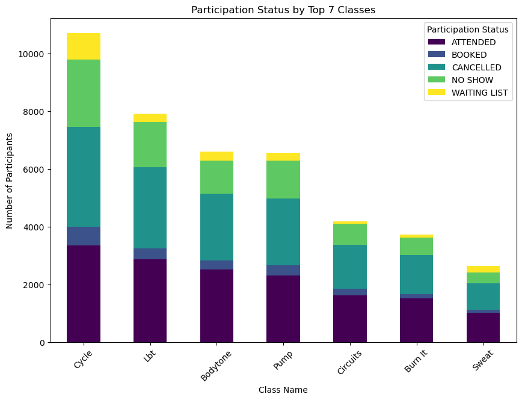
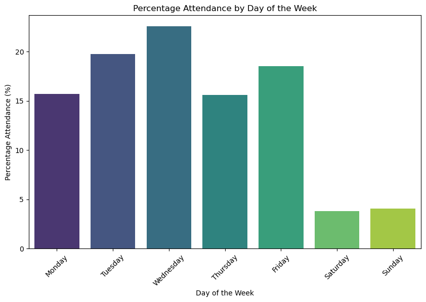
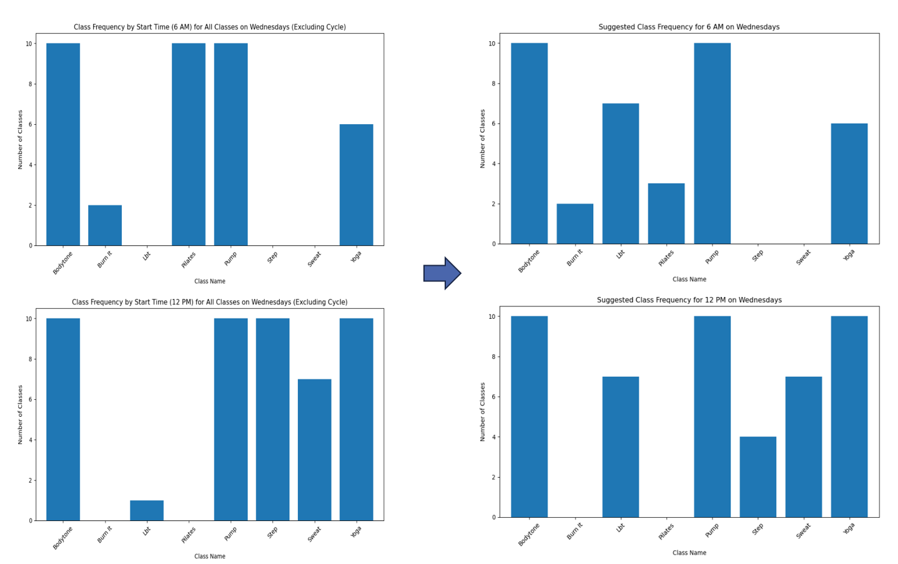
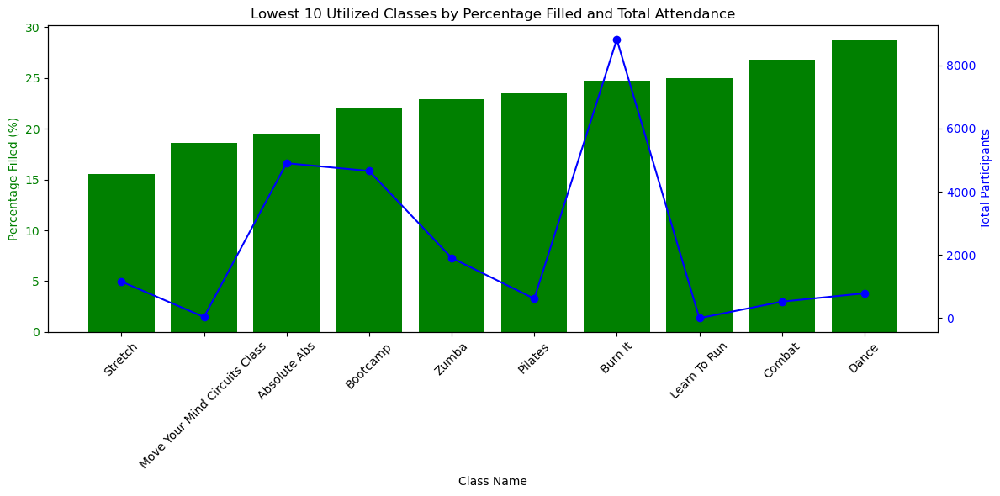

# Pure Gym Data Analysis

## Overview
This project is part of a group assignment for the Data Analytics course at the **London School of Economics (LSE)**, where I served as the project leader. The analysis focuses on understanding member behaviour and class attendance at PureGym, with the goal of optimising class schedules, reducing cancellations and no-shows, and improving overall member satisfaction. The analysis covers various metrics such as class popularity, attendance patterns, waitlist management, and gym capacity utilisation, addressing key questions around class performance, member participation trends, and resource optimisation.

## Business Background and Key Questions
PureGym, a leading UK gym chain, is facing challenges with underperforming classes, high cancellation rates, and no-shows, which negatively impact member satisfaction and overall gym performance. To address these concerns, this analysis aims to:

- **Identify Class Popularity**: Determine which classes are most and least popular across different demographics (e.g., gender, age) and times of the day.
- **Attendance Trends**: Analyse attendance patterns throughout the week, comparing weekdays to weekends, and identifying days with significant or low attendance.
- **Class Optimisation**: Assess underperforming classes to determine whether they should be rescheduled, reduced, or replaced to better align with member preferences.
- **Capacity Utilisation**: Explore how different times of day impact class capacity and find ways to maximise resource utilisation.
- **Member Engagement**: Suggest strategies to increase engagement by reducing cancellations and no-shows while improving attendance for underutilised classes.

## Data Cleaning and Preparation
### Steps Taken:
1. **Initial Data Exploration**
   - Used `file_data.info()` to understand data types and non-null counts for each column.
   - Used `file_data.describe()` to generate summary statistics for numerical columns.
   
2. **Handling Missing Values**
   - Checked for missing values to determine whether imputation or removal was required.

3. **Remove Redundant Columns**
   - Identified and removed unnecessary columns that were not useful for analysis.

4. **Check for Duplicates**
   - Checked for and removed duplicate records to ensure data integrity.

## Data Analysis Approach
### Tools and Libraries
This analysis mainly focuses on **Python**.

#### Libraries Used
- **Pandas (`import pandas as pd`)**: 
  - For data manipulation, including grouping, aggregating, and merging.
  
- **NumPy (`import numpy as np`)**: 
  - For numerical operations and data normalisation.

- **Matplotlib (`import matplotlib.pyplot as plt`)**: 
  - For visualisations, such as bar charts and histograms.

- **Seaborn (`import seaborn as sns`)**: 
  - For statistical graphics, including heatmaps and pair plots.

- **Statsmodels (`import statsmodels.api as sm`, `import statsmodels.stats.api as sms`)**: 
  - For statistical modelling and hypothesis testing.

- **Scikit-Learn (`import sklearn`)**: 
  - For predictive modelling and regression analysis.

## Key Insights and Recommendations Summary

### Patterns, Trends, and Insights
- **Challenges with Top Classes**: 
  - A significant number of popular classes face issues with cancellations, no-shows, and long waiting lists. 
  - Classes like **"Cycle"** and **"Leg Bum & Tums (LBT)"** are the most impacted.
  - Classes with high cancellation rates also have moderately high non-attendance rates, suggesting potential dissatisfaction among members due to missed opportunities. This results in underutilised sessions, even when there is demand from waitlisted members.
  
  

- **Day of the Week Analysis**:
  - **Wednesday** shows the highest attendance rate, exceeding **20%**, while other days fall below this threshold. Weekend days (**Saturday and Sunday**) have significantly lower attendance rates (<5%) compared to weekdays. 
  - This suggests that adding more classes on **Wednesday** could capitalise on higher engagement, while expanding weekend classes may not be as effective.

  

- **Popular vs. Underutilised Classes**:
  - On **Wednesdays**, classes such as **Pump, Cycle, and Bodytone** are highly popular, whereas **Yoga, Sweat, Zumba, Step, Pilates, and Burn It** experience lower attendance.
  - **Weekends** lack popular classes like **Bodytone**, presenting an opportunity to improve engagement.
  - **Zumba** is missing on Saturdays, and **Pilates** is not available on Sundays, potentially leading to missed opportunities for interested members.
  - Classes like **Yoga, Zumba, Dance, and Pilates** consistently have low attendance on weekends, suggesting the need for adjustments or replacements to boost engagement.

## Recommendations for Class Scheduling Optimisation

1. **Adjust Wednesday Class Schedule**:
   - Reallocate less popular classes to more in-demand classes to better align with member preferences and optimise attendance.

   

2. **Discontinue Low-Performance Classes**:
   - Consider removing classes with low attendance and engagement:
     - **'Move Your Mind Circuits Class'** (18.59% filled, 37 participants).
     - **'Learn To Run'** (25% filled, 2 participants).
   - Reallocate these time slots to high-demand activities or introduce new classes that could attract more participants.

   

3. **Enhance Engagement on Weekends**:
   - Given the lower weekend attendance, optimise current offerings rather than adding more sessions. Consider:
     - Introducing **popular classes like Bodytone** on weekends.
     - Replacing underperforming classes like **Yoga or Dance** with trial classes to gauge member interest.

4. **Long-Term Optimisation and Feedback Collection**:
   - Track the impact of the implemented schedule changes on member satisfaction, retention, and overall gym performance.
   - Introduce a feature in the **PureGym app** for members to provide reasons for class cancellations, enabling deeper insights into member preferences.
   - Continuously monitor and evaluate the data to identify new opportunities for optimisation, ensuring sustained success and better utilisation of gym resources.
